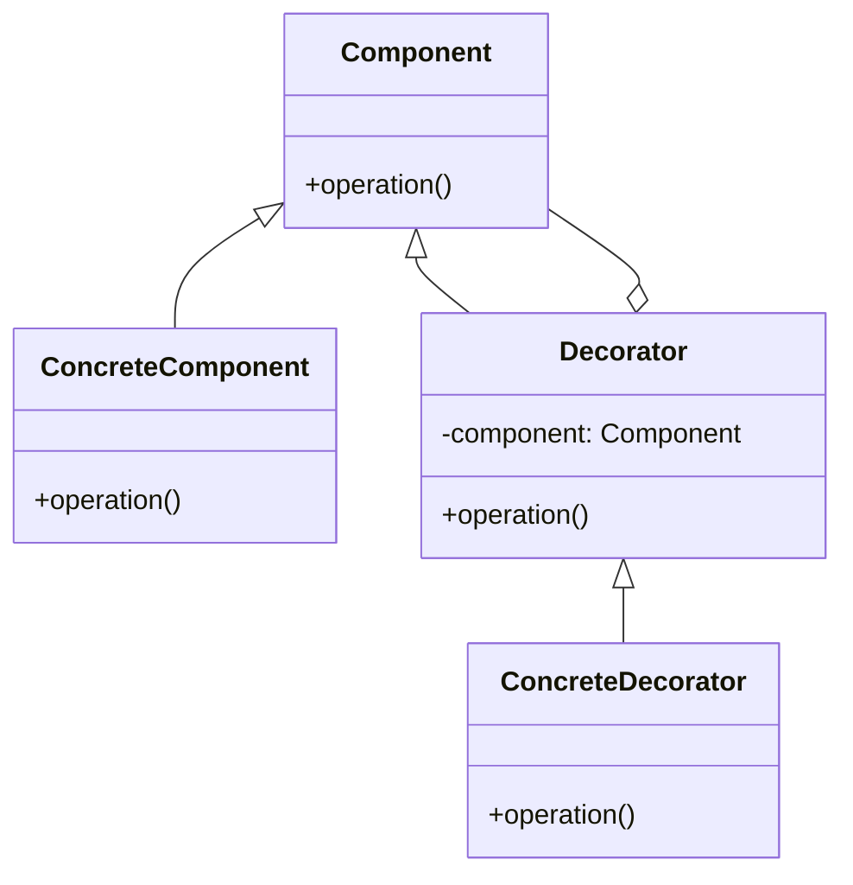

# 装饰器模式

装饰器模式（Decorator Pattern）是一种结构型设计模式，它允许向一个现有的对象添加新的功能，同时又不改变其结构。这种模式创建了一个装饰类，用来包装原有的类，并在保持类方法签名完整的前提下，提供了额外的功能。

## 主要角色

1. **Component（组件）**: 定义一个对象接口，可以给这些对象动态地添加职责。
2. **ConcreteComponent（具体组件）**: 定义一个具体的对象，也可以给这个对象添加一些职责。
3. **Decorator（装饰类）**: 维持一个指向Component对象的指针，并定义一个与Component接口一致的接口。
4. **ConcreteDecorator（具体装饰类）**: 具体的装饰对象，起到给Component添加职责的功能。

## UML 类图



## 示例代码

```python
class Component:
  def operation(self):
    pass

class ConcreteComponent(Component):
  def operation(self):
    print("ConcreteComponent operation")

class Decorator(Component):
  def __init__(self, component):
    self._component = component

  def operation(self):
    self._component.operation()

class ConcreteDecorator(Decorator):
  def operation(self):
    super().operation()
    print("ConcreteDecorator operation")

# 使用示例
component = ConcreteComponent()
decorator = ConcreteDecorator(component)
decorator.operation()
```

## 优点

- 装饰类和被装饰类可以独立发展，不会相互耦合。
- 装饰模式是继承的一个替代模式，可以动态扩展一个实现类的功能。

## 缺点

- 多层装饰比较复杂。
- 具体构件和具体装饰类之间的依赖关系不能通过接口来限制。

## 适用场景

- 在不影响其他对象的情况下，以动态、透明的方式给单个对象添加职责。
- 处理那些可以撤销的职责。
